## Kanban Board

   
 

Link to deployed site and screenshots 

[(https://kanbanboard-552l.onrender.com)](https://kanbanboard-552l.onrender.com/)

## Description 

This project created a full stack Kanban board with Auth

## Table of Contents  

[KanbanBoard](#kanban board)

[Description](#description)

[Table of Contents](#table-of-contents)

[Installation](#installation)

[Usage](#usage)

[License](#license)

[Contributing](#contributing)

[Tests](#tests)

[Questions](#questions)

  ## Installation  

install 
npm i 
npm install -g nodemon
npm i dotenv
npm i express
npm i pg
npm i sequelize
npm install typescript 
npm install jsonwebtoken bcrypt

{
  "name": "main",
  "version": "1.0.0",
  "description": "",
  "main": "index.js",
  "scripts": {
    "test": "echo \"Error: no test specified\" && exit 1",
    "start": "npm run client:build && npm run server",
    "start:dev": "concurrently \"npm run server:dev\" \"wait-on tcp:3001 && npm run client:dev\"",
    "server": "cd server && npm start",
    "server:dev": "cd server && npm run dev",
    "install": "cd server && npm i && cd ../client && npm i",
    "client:build": "cd client && npm run build",
    "client:dev": "cd client && npm run dev",
    "build": "cd client && npm run build",
    "seed": "cd server && npm run seed",
    "render-build": "npm install && npm run build"
  },
  "keywords": [],
  "author": "",
  "license": "ISC",
  "devDependencies": {
    "concurrently": "^8.2.2",
    "nodemon": "^3.1.3",
    "wait-on": "^7.2.0"
  },
  "dependencies": {
    "@types/express": "^5.0.0",
    "dotenv": "^16.4.5",
    "expres": "^0.0.5",
    "express": "^4.21.1",
    "pg": "^8.13.1",
    "sequelize": "^6.37.5",
    "typescript": "^5.6.3"
  }
}

The only way to safely create a database
psql -U postgres
\c kanban_db;
\dt
\c postgres
DROP DATABASE kanban_db;
DROP DATABASE
DROP DATABASE IF EXISTS kanban_db;
CREATE DATABASE kanban_db;

create database in render
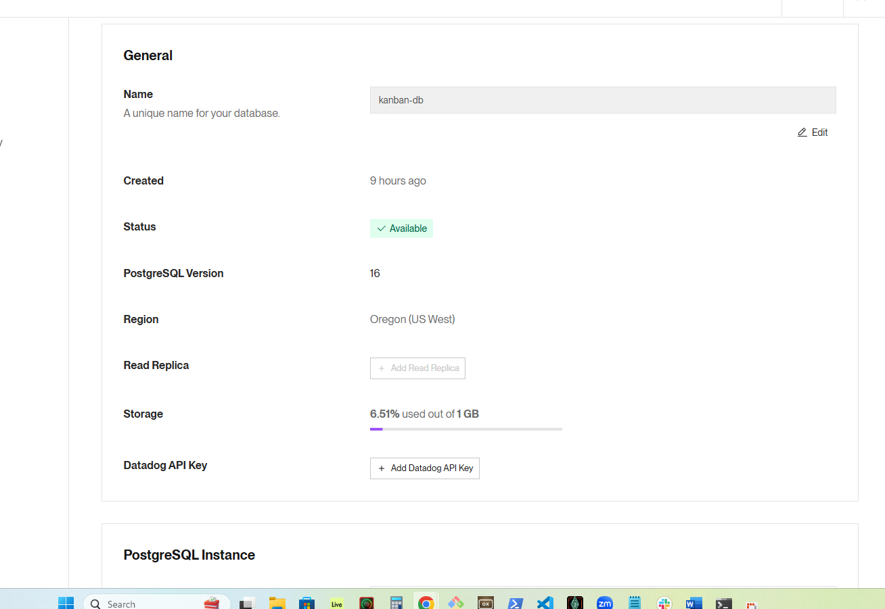

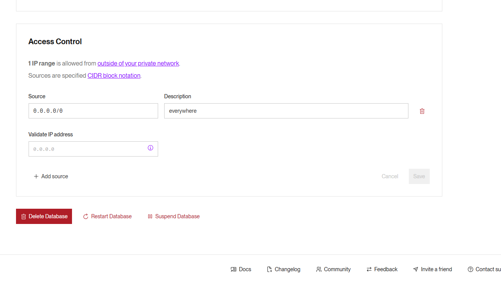

set env in main deploy

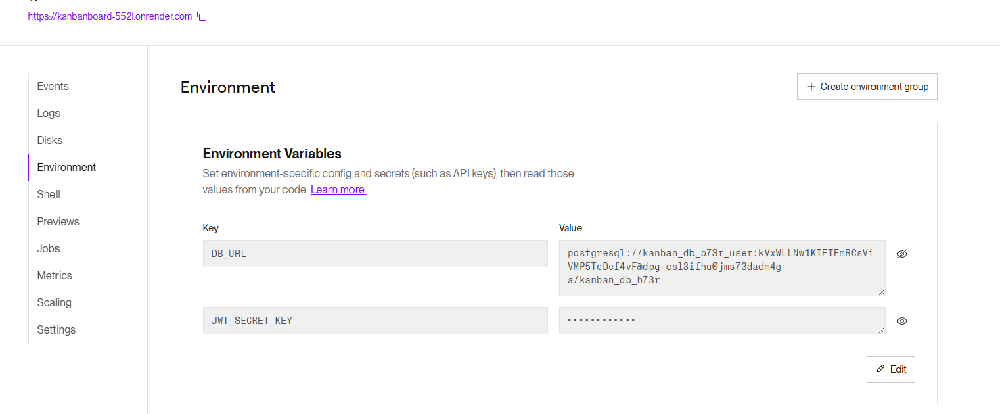

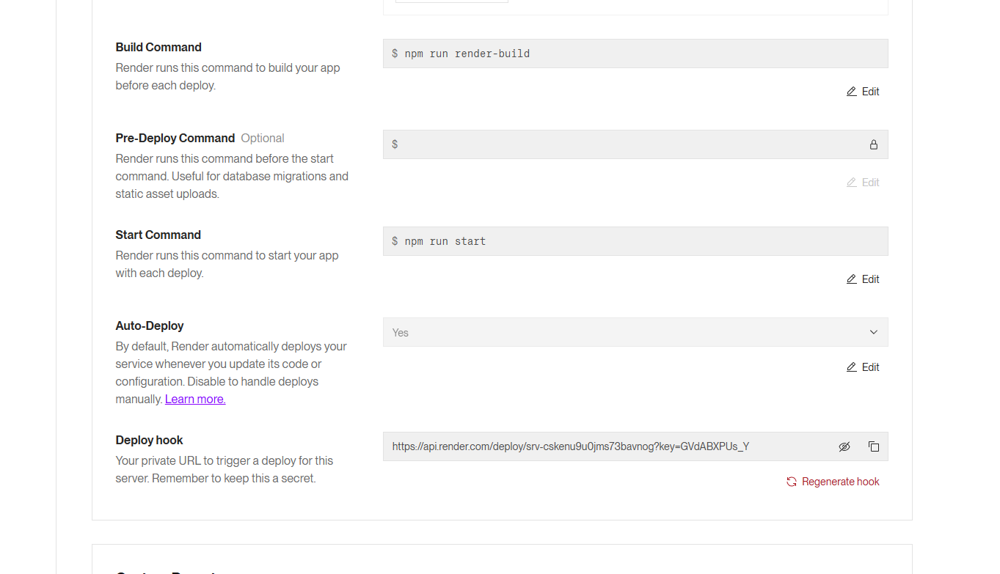

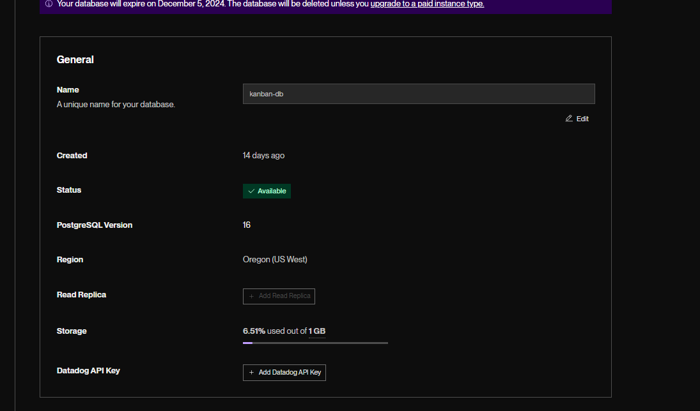

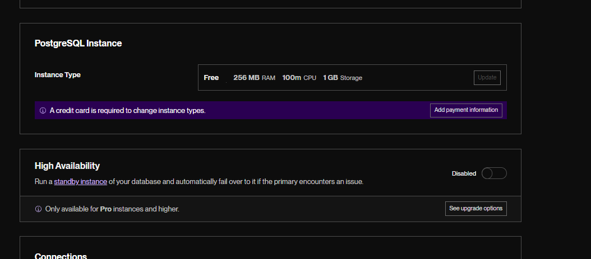

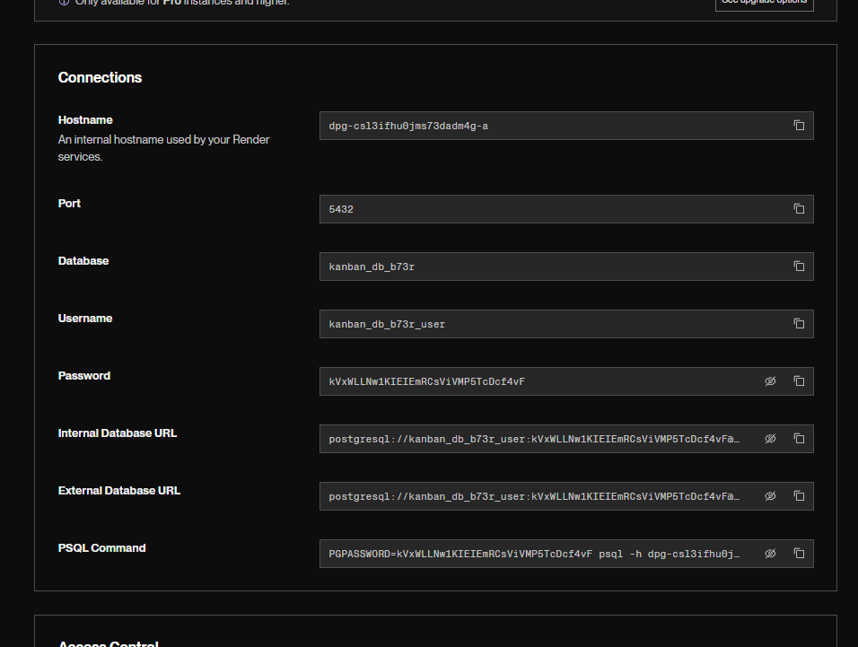

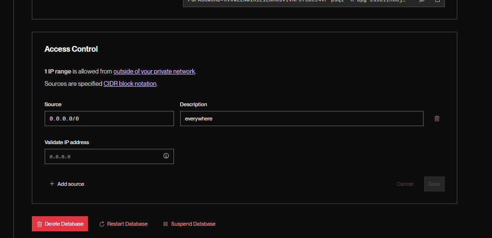

deployment 

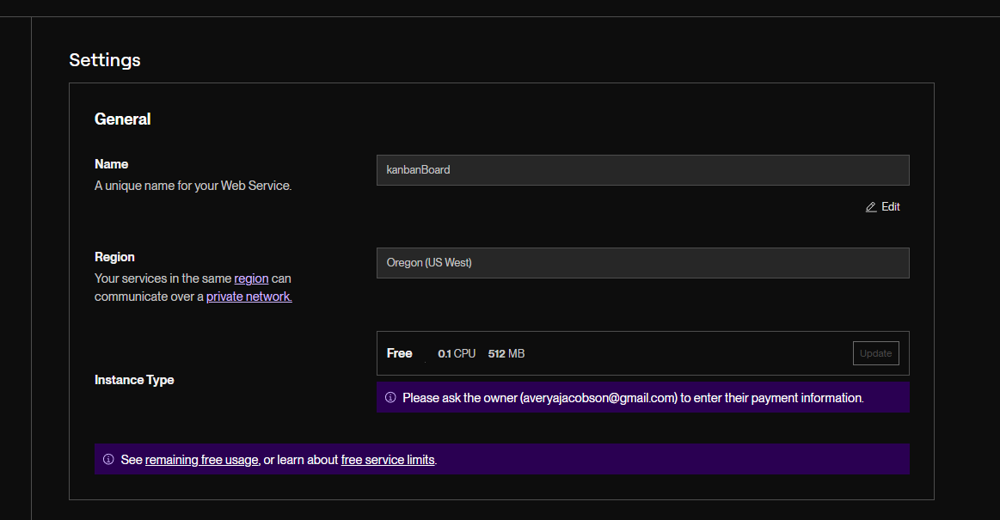

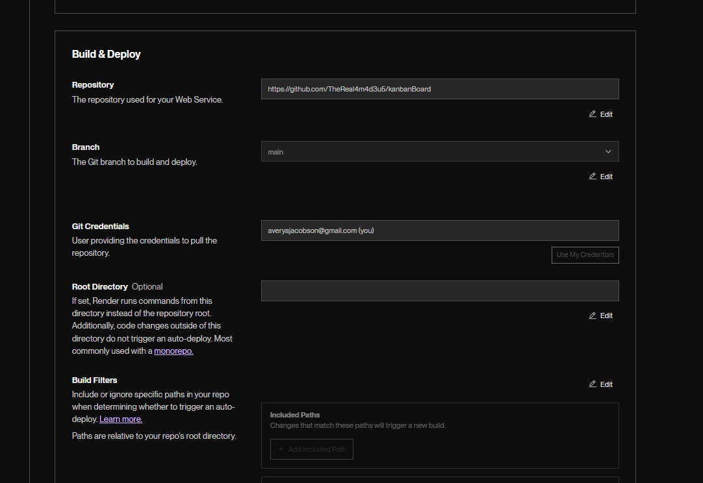

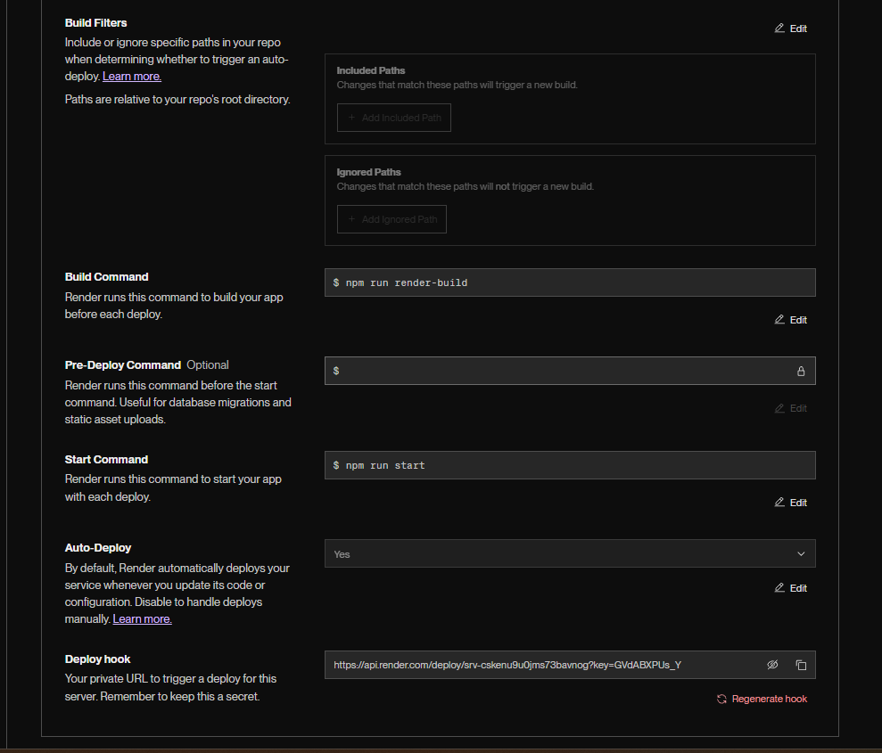

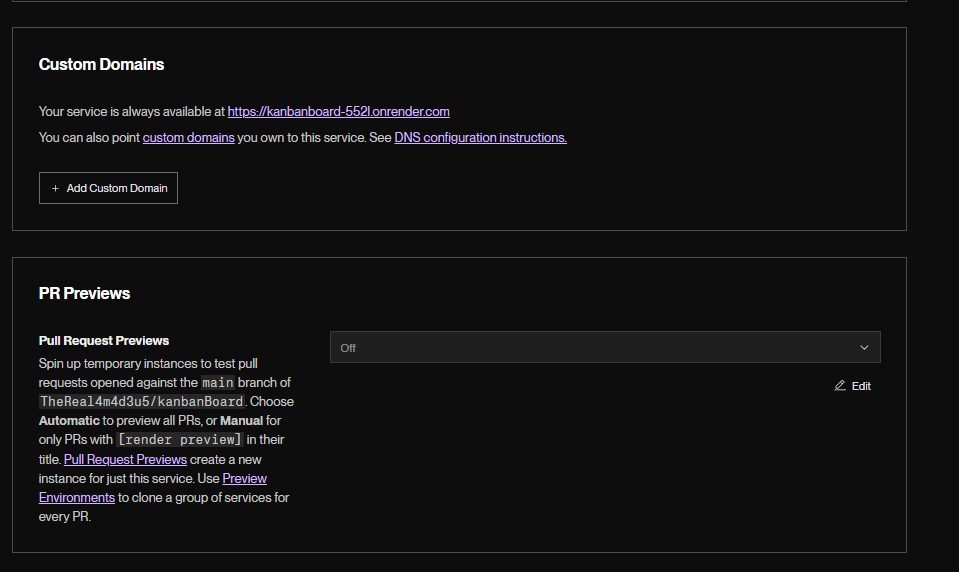

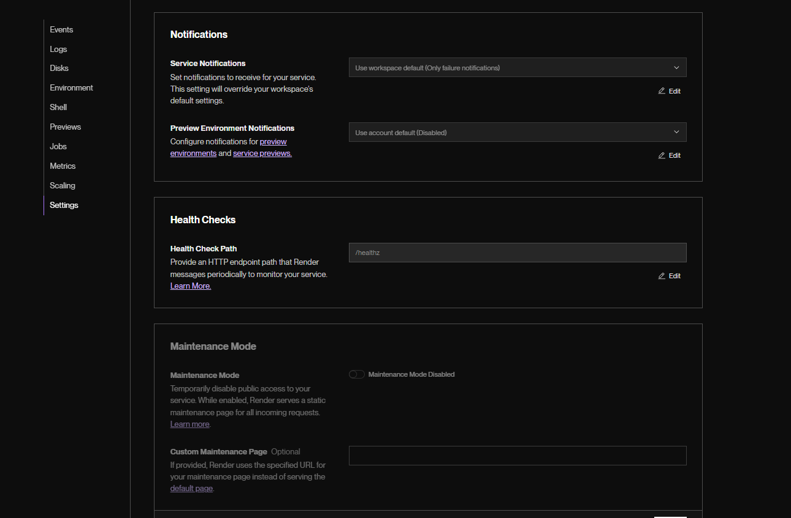

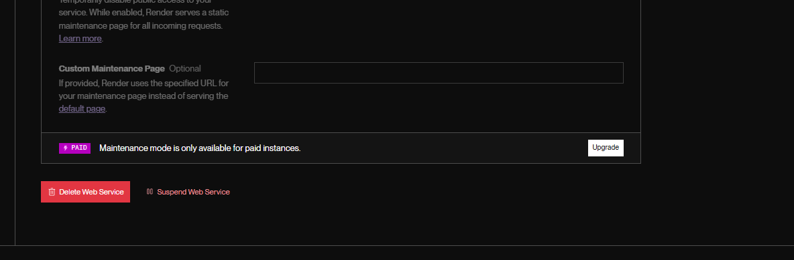

  ## Usage  

    Login using seeded credtials and create a ticket   

   

  ## License 

  This application is covered under the following license:  

   

  [![License: MIT]] (https://opensource.org/licenses/MIT) 

   

  ## Contributing  

  n/a 

   

  ## Tests  

  Login 

  Create ticket

  verify ticket has been created

  Do not move mouse and wait to be logged out, user is redirrected to login page

  Log in and use the logout button, user is redirected to login page. 
   
  ## Questions 

  Githubname: TheReal4m4d3u5

   

  https://github.com/TheReal4m4d3u5 

   

  averyajacobson@gmail.com 

