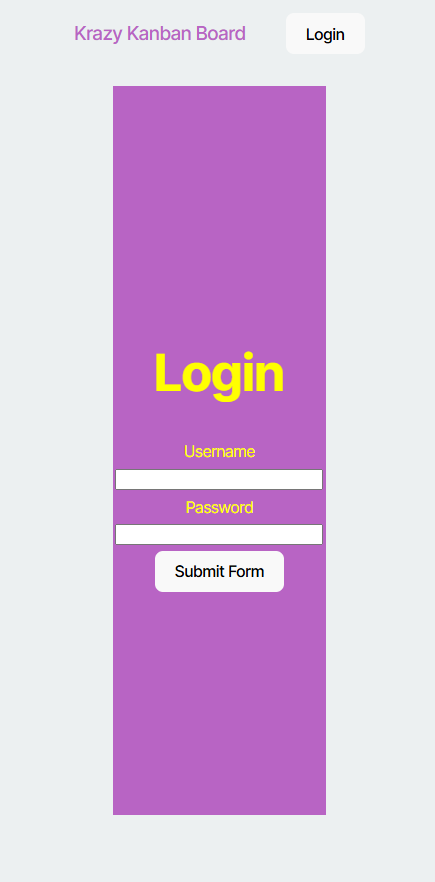
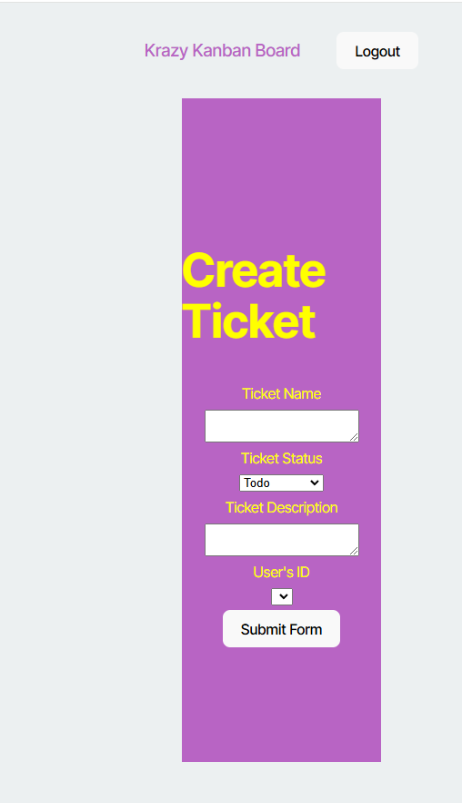
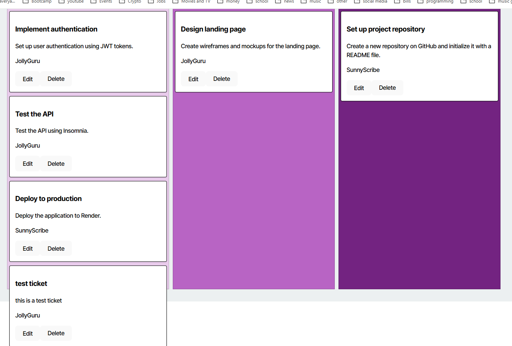

# WeatherAPP

   
 

Link to deployed Site 

[https://weatherapp-ew0q.onrender.com ](https://kanbanboard-552l.onrender.com)

## Description 

This project is to create a weather app that sends weather data to a client server and displays the current weather and the five day forcast

## Table of Contents  

[WeatherAPP](#weatherapp)

[Description](#description)

[Table of Contents](#table-of-contents)

[Installation](#installation)

[Usage](#usage)

[License](#license)

[Contributing](#contributing)

[Tests](#tests)

[Questions](#questions)

  ## Installation  

  Open this project in your visual studio code editor. Right click the index.js file and open in terminal. Type npm init -y and npm i to install the the dependencies.   

   

  ## Usage  

  in the terminal type node index and follow the instructions.  

   

  ## License 

  This application is covered under the following license:  

   

  [![License: MIT]] (https://opensource.org/licenses/MIT) 

   

  ## Contributing  

  n/a 

   

  ## Tests  

  All the inputs should be tested, open the README.md and open in markdown preview to make sure that everything is being generated properly.  

   
  ## Questions 

  Githubname: TheReal4m4d3u5

   

  https://github.com/TheReal4m4d3u5 

   

  averyajacobson@gmail.com 

