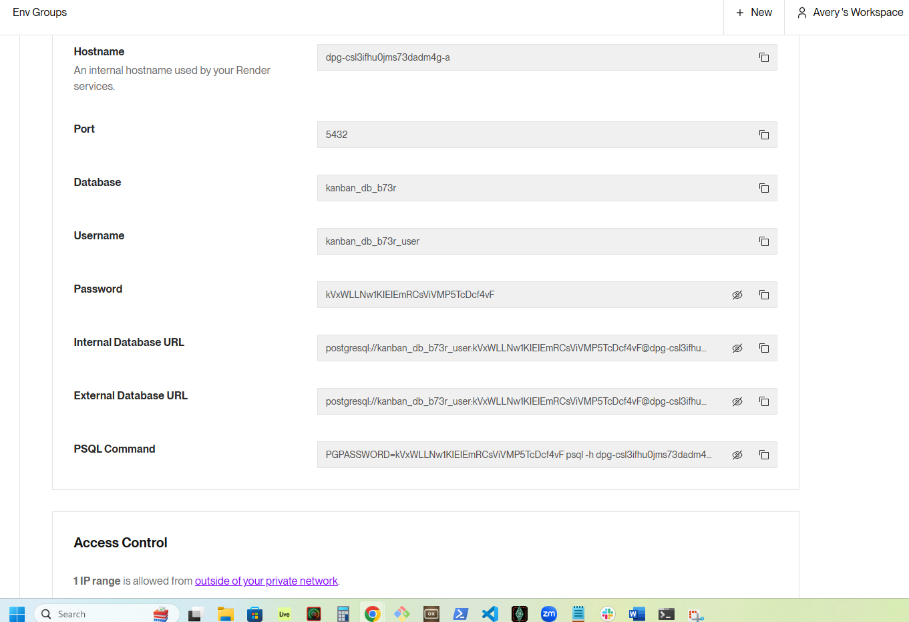

## Kanban Board

   
 

Link to deployed Site 

[https://weatherapp-ew0q.onrender.com ](https://kanbanboard-552l.onrender.com)

## Description 

This project is to create a weather app that sends weather data to a client server and displays the current weather and the five day forcast

## Table of Contents  

[KanbanBoard](#kanban board)

[Description](#description)

[Table of Contents](#table-of-contents)

[Installation](#installation)

[Usage](#usage)

[License](#license)

[Contributing](#contributing)

[Tests](#tests)

[Questions](#questions)

  ## Installation  

install 
npm i 
npm install -g nodemon
npm i dotenv
npm i express
npm i pg
npm i sequelize
npm install typescript 
npm install jsonwebtoken bcrypt

{
  "name": "main",
  "version": "1.0.0",
  "description": "",
  "main": "index.js",
  "scripts": {
    "test": "echo \"Error: no test specified\" && exit 1",
    "start": "npm run client:build && npm run server",
    "start:dev": "concurrently \"npm run server:dev\" \"wait-on tcp:3001 && npm run client:dev\"",
    "server": "cd server && npm start",
    "server:dev": "cd server && npm run dev",
    "install": "cd server && npm i && cd ../client && npm i",
    "client:build": "cd client && npm run build",
    "client:dev": "cd client && npm run dev",
    "build": "cd client && npm run build",
    "seed": "cd server && npm run seed",
    "render-build": "npm install && npm run build"
  },
  "keywords": [],
  "author": "",
  "license": "ISC",
  "devDependencies": {
    "concurrently": "^8.2.2",
    "nodemon": "^3.1.3",
    "wait-on": "^7.2.0"
  },
  "dependencies": {
    "@types/express": "^5.0.0",
    "dotenv": "^16.4.5",
    "expres": "^0.0.5",
    "express": "^4.21.1",
    "pg": "^8.13.1",
    "sequelize": "^6.37.5",
    "typescript": "^5.6.3"
  }
}

The only way to safely create a database
psql -U postgres
\c kanban_db;
\dt
\c postgres
DROP DATABASE kanban_db;
DROP DATABASE
DROP DATABASE IF EXISTS kanban_db;
CREATE DATABASE kanban_db;

create database in render

set env in main deploy

  ## Usage  

  in the terminal type node index and follow the instructions.  

   

  ## License 

  This application is covered under the following license:  

   

  [![License: MIT]] (https://opensource.org/licenses/MIT) 

   

  ## Contributing  

  n/a 

   

  ## Tests  

  All the inputs should be tested, open the README.md and open in markdown preview to make sure that everything is being generated properly.  

   
  ## Questions 

  Githubname: TheReal4m4d3u5

   

  https://github.com/TheReal4m4d3u5 

   

  averyajacobson@gmail.com 

